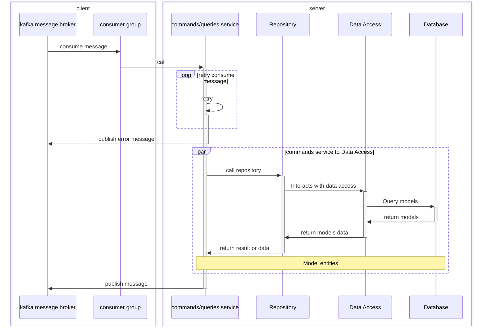

## Golang CQRS microservices 

#### 👨‍💻 Full list what has been used:
[Kafka](https://github.com/segmentio/kafka-go) as messages broker<br/>
[gRPC](https://github.com/grpc/grpc-go) Go implementation of gRPC<br/>
[PostgreSQL](https://github.com/jackc/pgx) as database<br/>
[Jaeger](https://www.jaegertracing.io/) open source, end-to-end distributed [tracing](https://opentracing.io/)<br/>
[Prometheus](https://prometheus.io/) monitoring and alerting<br/>
[Grafana](https://grafana.com/) for to compose observability dashboards with everything from Prometheus<br/>
[MongoDB](https://github.com/mongodb/mongo-go-driver) Web and API based SMTP testing<br/>
[Redis](https://github.com/go-redis/redis) Type-safe Redis client for Golang<br/>
[swag](https://github.com/swaggo/swag) Swagger for Go<br/>
[Echo](https://github.com/labstack/echo) web framework<br/>

## For local development 🙌👨‍💻🚀:

### Jaeger UI:

http://localhost:16686

### Prometheus UI:

http://localhost:9090

### Grafana UI:

http://localhost:3000

### Swagger UI:

http://localhost:5001/swagger/index.html

### Kafka console UI

Can use [conduktor](https://www.conduktor.io/) 

```
curl -L https://releases.conduktor.io/quick-start -o docker-compose.yml 
&& docker compose up -d --wait 
&& echo "Conduktor started on http://localhost:8080"
```

Add new cluster host by value of KAFKA_ADVERTISED_LISTENERS on docker-compose file to connect

#### Follow step to serve on local

```
1: make local or docker_dev                 // for run docker compose files
2: make migrate_up                          // run sql migrations
3: make mongo                               // run mongo init scripts
4: make swagger                             // generate swagger documentation
```
p/s: 
- please install [mongosh](https://www.mongodb.com/docs/mongodb-shell/install/), [migrate](https://github.com/golang-migrate/migrate) and [swagger](https://github.com/swaggo/swag) first
- When run on ubuntu maybe meet error relative with permission to access slave_pgdata and master_pgdata, we can use that cmd to by pass :

```
stay in ./Go-CQRS-Kafka-gRPC-Microservices

$ sudo chown -R $(whoami) $(pwd)/slave_data
$ sudo chown -R $(whoami) $(pwd)/master_data

```


## Project struct:

### Overview

#### System diagram


#### Project structure


#### Project structure folder tree
```
.
├── Makefile
├── README.md
├── core
│   ├── cmd
│   │   └── main.go
│   ├── config
│   │   ├── config.go
│   │   └── config.yaml
│   ├── migrations
│   │   ├── 000001_video_tables_init.down.sql
│   │   ├── 000001_video_tables_init.up.sql
│   │   └── mongo
│   │       └── init.js
│   ├── models
│   │   └── product.go
│   ├── monitoring
│   │   ├── prometheus.yml
│   │   └── prometheus_docker.yml
│   ├── pkg
│   │   ├── constants
│   │   │   └── constants.go
│   │   ├── http_client
│   │   │   └── http_client.go
│   │   ├── http_errors
│   │   │   └── http_errors.go
│   │   ├── http_utils
│   │   │   └── http_utils.go
│   │   ├── interceptors
│   │   │   └── manager.go
│   │   ├── kafka
│   │   │   ├── client.go
│   │   │   ├── config.go
│   │   │   ├── constants.go
│   │   │   ├── consumer_group.go
│   │   │   ├── producer.go
│   │   │   ├── reader.go
│   │   │   └── writer.go
│   │   ├── logger
│   │   │   └── logger.go
│   │   ├── mongodb
│   │   │   └── mongodb.go
│   │   ├── postgres
│   │   │   └── postgres.go
│   │   ├── probes
│   │   │   └── probes.go
│   │   ├── redis
│   │   │   └── redis.go
│   │   ├── tracing
│   │   │   ├── jaeger.go
│   │   │   └── utils.go
│   │   └── utils
│   │       └── pagination.go
│   └── proto
│       └── kafka
│           ├── kafka.pb.go
│           └── kafka.proto
├── docker
│   ├── reader_service.Dockerfile
│   └── writer_service.Dockerfile
├── docker-compose.local.yaml
├── docker-compose.yaml
├── docs
│   ├── docs.go
│   ├── resource
│   │   ├── CQRS_diagram.svg
│   │   └── DDD_go.postman_collection.json
│   ├── swagger.json
│   └── swagger.yaml
├── go.mod
├── go.sum
├── main
├── monitoring
│   ├── prometheus.yml
│   └── prometheus_docker.yml
├── reader_service
│   ├── cmd
│   │   └── main.go
│   ├── config
│   │   ├── config.go
│   │   └── config.yaml
│   └── internal
│       ├── delivery
│       │   ├── grpc
│       │   │   └── grpc_service_product.go
│       │   └── kafka
│       │       ├── consumer_group.go
│       │       ├── create_product_consumer.go
│       │       ├── delete_product_consumer.go
│       │       ├── update_product_consumer.go
│       │       └── utils.go
│       ├── domain
│       │   ├── models
│       │   │   └── product.go
│       │   ├── repositories
│       │   │   └── product.go
│       │   └── usecase
│       │       └── product.go
│       ├── dto
│       │   ├── product.go
│       │   └── proto
│       │       └── product_reader
│       │           ├── product_reader.pb.go
│       │           ├── product_reader.proto
│       │           ├── product_reader_grpc.pb.go
│       │           ├── product_reader_messages.pb.go
│       │           └── product_reader_messages.proto
│       ├── metrics
│       │   └── product_metrics.go
│       ├── repositories
│       │   └── product
│       │       ├── mongo_repository_impl.go
│       │       ├── pg_repository_impl.go
│       │       ├── redis_repository_impl.go
│       │       └── sql_queries.go
│       ├── server
│       │   ├── grpc_server.go
│       │   ├── server.go
│       │   └── utils.go
│       └── usecase
│           ├── pg_usecase_impl.go
│           └── product
└── writer_service
    ├── cmd
    │   └── main.go
    ├── config
    │   ├── config.go
    │   └── config.yaml
    ├── internal
    │   ├── delivery
    │   │   ├── grpc
    │   │   │   └── grpc_service_product.go
    │   │   └── kafka
    │   │       ├── consumer_group.go
    │   │       ├── create_product_consumer.go
    │   │       ├── delete_product_consumer.go
    │   │       ├── update_product_consumer.go
    │   │       └── utils.go
    │   ├── domain
    │   │   ├── models
    │   │   │   └── product.go
    │   │   ├── repositories
    │   │   │   └── product.go
    │   │   └── usecase
    │   │       └── product.go
    │   ├── dto
    │   │   ├── product.go
    │   │   └── proto
    │   │       └── product_writer
    │   │           ├── product_writer.pb.go
    │   │           ├── product_writer.proto
    │   │           ├── product_writer_grpc.pb.go
    │   │           ├── product_writer_messages.pb.go
    │   │           └── product_writer_messages.proto
    │   ├── mappers
    │   │   └── product_mapper.go
    │   ├── metrics
    │   │   └── product_metrics.go
    │   ├── middlewares
    │   │   ├── cors.go
    │   │   ├── middlewares.go
    │   │   └── recover.go
    │   ├── repositories
    │   │   └── product
    │   │       ├── pg_repository_impl.go
    │   │       └── sql_queries.go
    │   ├── routes.go
    │   └── usecase
    │       └── product
    │           └── pg_usecase_impl.go
    └── server
        ├── grpc_server.go
        ├── server.go
        └── utils.go
```

#### Note
- ./cmd: main file to start server
- ./config: read and load file config
- ./internal
  - /client: init client to call another services
  - /dto: define and mapping request response to delivery request
  - /metrics: init and config metrics for prometheus
  - /middlewares: define middle func
  - /delivery: define router and handler for protocol (http, gprc, ...) transport data to usecase layer
  - /usecase: usecase layer define handler logic
  - /repositories: repository layer define command, queries to access data from third party (database, cache db, ...)
  - /domain: 
    - /models: define models
    - /repositories: define method for data access models
    - /usecase: define method for logic of models
  - /server: init and setup server
- ./docker: store dockerfile
- ./migrations: store migrate up and down file
- ./monitoring: config prometheus 
- ./pkg: define all package file or tool
  - /constants: define all const value or global value
  - /utils: define all utils func
  - /tracing: init config jaeger
  - ...: connection for database or third party
- ./proto: proto file
- ./script: migrate for mongodb
- makefile: define all command for quick run

### struct of consumer (reader and writer services)

Flow handle message 



## Implement 👨‍💻🚀:
I use [ent](https://entgo.io/) for working with DB. Ent is An entity framework for Go, It Simple, yet powerful ORM for modeling and querying data.

Install that by one command:
```shell
go install entgo.io/ent/cmd/ent@latest
```

To start with your model, please follow that to generate your model struct: 

```shell
go run -mod=mod entgo.io/ent/cmd/ent new ${table_name}
```

After run that we will have generate code on ent/schema/${table_name}.go:


You can customize table name by add that code on schema/${table_name}.go:
```go
func (Videos) Annotations() []schema.Annotation {
	return []schema.Annotation{
		entsql.Annotation{Table: "${table_name_custom}"},
	}
}
```

And config column, relationship, type... on schema/${table_name}.go:
```go
// Fields of the User.
func (User) Fields() []ent.Field {
    return []ent.Field{
        field.Int("age").
            Positive(),
        field.String("name").
            Default("unknown"),
    }
}
```

After config that, please run:
```shell
go generate ./ent
```

Result will be like that:
```
./ent
├── client.go
├── ent.go
├── enttest
│   └── enttest.go
├── generate.go
├── hook
│   └── hook.go
├── migrate
│   ├── migrate.go
│   └── schema.go
├── mutation.go
├── predicate
│   └── predicate.go
├── runtime
│   └── runtime.go
├── runtime.go
├── schema
│   └── videos.go
├── tx.go
├── videos
│   ├── videos.go
│   └── where.go
├── videos.go
├── videos_create.go
├── videos_delete.go
├── videos_query.go
└── videos_update.go
```

Currently, we can use generate crud code by init ent client connection:
```go
func CreateUser(ctx context.Context, client *ent.Client) (*ent.User, error) {
  u, err := client.User.
            Create().
            SetAge(30).
            SetName("a8m").
            Save(ctx)
  if err != nil {
  return nil, fmt.Errorf("failed creating user: %w", err)
  }
  log.Println("user was created: ", u)
  return u, nil
}
```


